# Job Application Engine
**Version 2.1.1 — Generic Universal Edition**

**Author: _Ahmed AW (Ben Zayed) | Product Leader & Builder_**

An end-to-end AI-powered job application system for Claude, Claude CoWork, and Manus.
Supports two **session entry** modes: Mode A discovers matching roles across 10 platforms;
Mode B takes a CV and job URL directly and applies without discovery. **v2.1.x** adds two **execution** modes on CoWork — `agent_supported` (default) and optional `cowork_autonomous` with mandatory re-anchor to phase governance — see [docs/EXECUTION_MODES.md](docs/EXECUTION_MODES.md). Runs an 8-phase
workflow with a native automation layer executing **16** declared actions (A01–A16) on the user's
behalf under a three-tier consent system. Job board and ATS platform MCPs are detected
automatically at session start — if none are connected, the skill searches online and
recommends available options.

> **No external agents or frameworks required.** All logic is embedded in the skill
> files. Drop the ZIP into any supported platform and run.

---

## Quick Start

1. [Download `JAE-v2.1.1-Generic-Universal-2026-04-25.zip` from the v2.1.1 release Assets](https://github.com/ahmedbenaw/job-application-engine/releases/tag/v2.1.1)
2. Install the skill: **Claude.ai / Claude CoWork** — **Customize → Skills → Create Skill → Upload ZIP**. **Manus** — **Skills → + Add → Upload** or **Import from GitHub** (see [Platform Setup](#platform-setup)).
3. Choose your entry mode:

**Mode A — Discover roles matching your profile:**
> *"Find me Senior Product Manager roles in Berlin with relocation support"*
> The skill searches 10 platforms, ranks results, and guides the full workflow.

**Mode B — Apply to a specific role you already have:**
> Upload your CV (PDF or DOCX) + paste the job URL in the same message.
> The skill skips discovery entirely and runs the full application workflow
> for that specific role — from company intelligence through to submission.

---

## What This Skill Does

The engine runs an 8-phase workflow governed by scoring gates. Every phase produces
output, presents it for review, and requires a score of 5 out of 5 before advancing.
A score below 5 triggers a revision loop within the same phase.

**Execution modes (CoWork only; v2.1.x):** Default **`agent_supported`**. Optional **`cowork_autonomous`** uses larger host execution chunks with **`APPROVE COCHUNK`** (Tier 2), then **A15** re-anchor and **A16** drift check — phases and consent tiers are never bypassed. Details: [docs/EXECUTION_MODES.md](docs/EXECUTION_MODES.md).

**A0 — Capability Detection:** probes all tools and MCP connections at session start,
including a dedicated scan of 10 job board and ATS platform MCPs (LinkedIn, Indeed,
Greenhouse, Lever, Workday, Ashby, Wellfound, SmartRecruiters, Breezy HR, Recruitee).
If none are connected, it searches online and presents recommended MCPs. Presents the
full Capability Map before any phase begins.

**Session Entry Gate:** detects the session mode automatically from uploaded files,
URLs, and message content. Routes to Mode A or Mode B without the user needing to
specify. Presents both options explicitly if the mode is ambiguous.

**Mode A — Job Discovery:** user wants to find matching roles. Proceeds to Phase 0.

**Mode B — Direct Application:** user has a specific role. Upload a CV and paste a
job URL — Phase 0 is skipped entirely, and the skill runs Phases 1–7 for that role.

**Phase 0 — Job Discovery (Mode A only):** searches 10 platforms in two passes,
uses active job board MCPs for authenticated access where available, filters excluded
geographies, ranks results by relocation support and level match, flags the top 5.

**Phase 1 — Company Intelligence:** runs four parallel operations — job posting fetch,
application form fetch with platform-aware strategy, hiring manager identification,
and company and product research — producing a Company Intelligence Brief.

**Phase 2 — Fit Analysis:** adversarial two-column gap mapping against the candidate
profile. Returns one of three verdicts: Clean Fit, Honest Stretch, or Mismatch.
A Mismatch verdict halts the workflow — no application materials are produced.

**Phase 3 — Clarifying Intake:** collects all remaining inputs in a single block —
portfolio URL, salary confirmation, availability, relocation, custom form questions,
product trial observation, and language level where required.

**Phase 4 — Application Package:** produces all deliverables — standard form fields,
experience summary, five-paragraph cover letter following both canonical templates,
and copy-paste answers to every custom question. Routes through Phase 5 before presenting.

**Phase 5 — Writing Quality Pass:** 25-pattern audit across 5 families removes
AI-generated patterns. Two internal passes run; only the final version is presented.

**Phase 6 — Governance Gate:** eight sequential checks verify completeness, claim
traceability, salary format, gap acknowledgment, token resolution, word count, URL
validity, and salary field type. No package is presented with a known open check.

**Phase 7 — Post-Submission Loop:** three branches — submitted (anchors next
discovery), withdrawn (logs reason, refines next pass), rejected (identifies gap,
recalibrates search).

**Automation Layer (v2.1.x):** 16 declared automations (A01–A16) execute on the
user's behalf under a three-tier consent system. A14–A16 orchestrate CoWork autonomous chunks and governance re-anchor only when applicable. Scoring gates evaluate quality.
Approval gates authorise real-world actions. These are entirely separate systems.

---

## Workflow Diagram

```mermaid
flowchart TB

  %% ── SESSION START ─────────────────────────────────────
  START([" 🟢 Session Start "]):::entry

  %% ── EXECUTION MODE (before A0; CoWork can opt in to cowork_autonomous) ──
  subgraph EM["  Execution mode · before A0"]
    direction TB
    EM_SET["Set execution mode\ndefault agent_supported\nCoWork: opt-in autonomous"]:::step
  end
  START --> EM_SET

  %% ── A0 — CAPABILITY DETECTION (order matches SKILL.md A0) ──
  subgraph CAP["  A0 · Capability Detection"]
    direction TB
    A0_PT["STEP 1 · Probe core tools\n+ Job Board MCPs (1B)"]:::step
    A0_REC["STEP 1C · MCP discovery\n(if all JB/ATS MCPs inactive)"]:::autonode
    A0_CM["STEP 2 · Build & present\nCapability Map"]:::step
    A0_2A["STEP 2A · Mandatory artifact\nfallback if files/shell inactive"]:::autonode
    A0_BD["STEP 3 · Browser path note\nBrowserBase / Playwright / manual"]:::step
    A0_OK{STEP 4 · Map OK ·\nShall we begin?}:::gate
    A0_PT --> A0_REC --> A0_CM --> A0_2A --> A0_BD --> A0_OK
    A0_OK -- No / revise --> A0_CM
  end
  EM_SET --> A0_PT

  %% ── SESSION ENTRY GATE ────────────────────────────────
  subgraph SEG["  Session Entry Gate"]
    direction LR
    SEG_D{Mode\nDetected?}:::gate
    SEG_A["Mode A\nJob Discovery"]:::step
    SEG_B["Mode B\nDirect Apply"]:::step
    SEG_D -- "Mode A" --> SEG_A
    SEG_D -- "Mode B\nCV + Job URL" --> SEG_B
  end
  A0_OK -- Yes --> SEG_D

  %% ── PHASE 0 — JOB DISCOVERY (Mode A only) ────────────
  subgraph PH0["  P0 · Job Discovery  ·  Mode A only"]
    direction LR
    P0_PS["Platform Search\n& Filter"]:::step
    P0_JB["Job Board\nFetch"]:::step
    P0_MCP["Job Board MCP\nif active"]:::autonode
    P0_G{Top 5\nScored?}:::gate
    P0_FJ["Full JD\nFetch"]:::step
    P0_PS --> P0_JB --> P0_MCP --> P0_G
    P0_G -- No --> P0_PS
    P0_G -- Yes --> P0_FJ
  end
  SEG_A --> PH0

  %% ── PHASE 1 — COMPANY INTELLIGENCE ──────────────────
  subgraph PH1["  P1 · Company Intelligence"]
    direction LR
    P1_PR["Parallel\nResearch"]:::step
    P1_FF["Form Fetch\n& Parse"]:::step
    P1_G{Company\nScore 5?}:::gate
    P1_PR --> P1_FF --> P1_G
    P1_G -- No --> P1_PR
  end
  P0_FJ --> PH1
  SEG_B --> PH1

  %% ── PHASE 2 — FIT ANALYSIS ───────────────────────────
  subgraph PH2["  P2 · Fit Analysis"]
    direction LR
    P2_FV{Fit\nVerdict?}:::gate
    P2_MH(["🚫 Mismatch\nHalt"]):::halt
    P2_RE["Role & Requirements\nExtraction"]:::step
    P2_EM["Evidence\nMapping"]:::step
    P2_FS{Fit\nScore 5?}:::gate
    P2_FV -- Mismatch --> P2_MH
    P2_FV -- "Clean Fit or\nHonest Stretch" --> P2_FS
    P2_FS -- No --> P2_RE --> P2_EM --> P2_FS
  end
  P1_G -- Yes --> PH2

  %% ── PHASE 3 — CLARIFYING INTAKE ─────────────────────
  subgraph PH3["  P3 · Clarifying Intake"]
    direction LR
    P3_CG["Critical Gates\n& Research"]:::step
    P3_EH["Email Hiring\nManager"]:::autonode
    P3_G{Intake\nScore 5?}:::gate
    P3_CG --> P3_EH --> P3_G
    P3_G -- No --> P3_CG
  end
  P2_FS -- Yes --> PH3

  %% ── PHASE 4 — APPLICATION PACKAGE ───────────────────
  subgraph PH4["  P4 · Application Package"]
    direction LR
    P4_SQ{Save to\nCloud?}:::gate
    P4_CS["Cloud\nSave"]:::storage
    P4_PM["Prepare Application\nMaterials"]:::step
    P4_CL["Create Cover\nLetter"]:::step
    P4_LD["Local\nDownload"]:::storage
    P4_G{Package\nScore 5?}:::gate
    P4_SQ -- Yes --> P4_CS --> P4_PM
    P4_SQ -- No --> P4_PM
    P4_PM --> P4_CL --> P4_LD --> P4_G
    P4_G -- No --> P4_SQ
  end
  P3_G -- Yes --> PH4

  %% ── PHASE 5 — WRITING QUALITY PASS ──────────────────
  subgraph PH5["  P5 · Writing Quality Pass"]
    direction LR
    P5_PA["Pattern Removal\n& Audit"]:::step
    P5_G{Writing\nScore 5?}:::gate
    P5_PA --> P5_G
    P5_G -- No --> P5_PA
  end
  P4_G -- Yes --> PH5

  %% ── PHASE 6 — GOVERNANCE GATE ────────────────────────
  subgraph PH6["  P6 · Governance Gate"]
    direction LR
    P6_SC{Save to\nCloud 2?}:::gate
    P6_CS2["Cloud\nSave 2"]:::storage
    P6_BF["Browser\nForm Fill"]:::danger
    P6_AS["Application\nSubmit"]:::danger
    P6_G{Governance\nScore 5?}:::gate
    P6_SQ["Sequential\nChecks"]:::step
    P6_FP["Create Full\nPackage Doc"]:::step
    P6_LD["Local\nDownload 2"]:::storage
    P6_SC -- Yes --> P6_CS2 --> P6_BF
    P6_SC -- No --> P6_BF
    P6_BF --> P6_AS --> P6_G
    P6_G -- No --> P6_SQ --> P6_FP --> P6_LD --> P6_SC
  end
  P5_G -- Yes --> PH6

  %% ── PHASE 7 — POST SUBMISSION LOOP ──────────────────
  subgraph PH7["  P7 · Post Submission Loop"]
    direction LR
    P7_OB{Outcome\nBranching}:::gate
    P7_A["Branch A\nSubmitted"]:::branchA
    P7_B["Branch B\nWithdrawn"]:::branchB
    P7_C["Branch C\nRejected"]:::branchC
    P7_CR["Calendar\nReminder"]:::step
    P7_ES["Email\nto Self"]:::step
    P7_G{Post-Submission\nScore 5?}:::gate
    P7_OB -- Submitted --> P7_A
    P7_OB -- Withdrawn --> P7_B
    P7_OB -- Rejected --> P7_C
    P7_A --> P7_CR --> P7_ES --> P7_G
    P7_B --> P7_G
    P7_C --> P7_G
    P7_G -- No --> P7_OB
  end
  P6_G -- Yes --> PH7

  %% ── SESSION END ──────────────────────────────────────
  NEXT([" 🔄 Next Discovery "]):::entry
  DONE([" ⏹ Session Close "]):::entry
  P7_G -- "Yes · Branch A" --> NEXT
  NEXT -. "back to P0" .-> PH0
  P7_G -- "Yes · B or C" --> DONE

  %% ── LEGEND ───────────────────────────────────────────
  subgraph LEGEND["  Legend — Consent Tiers · separate from scoring"]
    direction LR
    LL1["⚡ Tier 1 — Auto\nRead-only · no gate"]:::step
    LL2["📄 Tier 2 — APPROVE\nReversible write"]:::step
    LL3["🚀 Tier 3 — APPROVE PHRASE\nIrreversible · full preview\nScore ≠ Approval"]:::danger
    LLG{Score Gate\n1–5 · need 5}:::gate
    LLS([Session\nStart/End]):::entry
  end

  %% ── STYLES — light mode ──────────────────────────────
  classDef entry    fill:#ccfbf1,stroke:#0d9488,stroke-width:2px,color:#134e4a,font-weight:bold
  classDef step     fill:#e0f2fe,stroke:#0284c7,stroke-width:1.5px,color:#0c4a6e
  classDef autonode fill:#fff7ed,stroke:#ea580c,stroke-width:1.5px,color:#7c2d12
  classDef gate     fill:#dcfce7,stroke:#16a34a,stroke-width:2px,color:#14532d,font-weight:bold
  classDef halt     fill:#fee2e2,stroke:#dc2626,stroke-width:2.5px,color:#7f1d1d,font-weight:bold
  classDef danger   fill:#fecaca,stroke:#ef4444,stroke-width:2px,color:#7f1d1d
  classDef storage  fill:#ede9fe,stroke:#7c3aed,stroke-width:1.5px,color:#4c1d95
  classDef branchA  fill:#d1fae5,stroke:#059669,stroke-width:1.5px,color:#064e3b
  classDef branchB  fill:#ffedd5,stroke:#f97316,stroke-width:1.5px,color:#7c2d12
  classDef branchC  fill:#fee2e2,stroke:#ef4444,stroke-width:1.5px,color:#7f1d1d
```



| Symbol | Meaning |
|--------|---------|
| 🟢 Teal pill | Session start **and** end — both `Session Start` and `Session Close` |
| 🟩 Green diamond | Scoring gate — 5/5 required · loops back on fail |
| 🟦 Blue rectangle | Process step — auto-executes · also Tier 2 reversible actions |
| 🟧 Orange rectangle | Automation/special runtime node (e.g. MCP discovery, artifact fallback, or consent-triggered action) |
| 🟥 Red rounded pill | **Mismatch halt** — workflow stops entirely |
| 🟣 Purple rectangle | File storage — local download always before cloud save |
| 🔴 Light-red rectangle | Irreversible action — `APPROVE SUBMIT` and `APPROVE FILL` |
| `- -` Dashed arrow | Loop back to Phase 0 after successful submission |

---

## Who It Is For

This generic edition works for any job seeker running a structured, disciplined
application process. It is particularly suited to candidates applying across multiple
markets, targeting different seniority levels simultaneously, or managing several
active applications in parallel. The Applicant Profile template holds multiple versions
of key fields — positioning headlines, professional summaries, evidence selection —
so the system adapts to each role without starting from scratch.

---

## Repository Structure

```
job-application-engine/
├── README.md                                ← This file + workflow diagram
├── LICENSE                                  ← MIT licence
├── CHANGELOG.md                             ← Version history (v1.0 · v2.x)
├── .gitignore
├── SKILL.md                                 ← Main skill file
│                                               8-phase engine + automation layer
├── rules.json                               ← Machine-readable workflow rules
│                                               + automation layer bindings
├── automation-registry.json                 ← All 16 declared automations
│                                               (A01–A16) · scope-locked
├── docs/                                    ← Canonical platform + scope + execution modes
└── references/
    ├── applicant-profile-template.md        ← Central source of truth · fill first
    ├── cover-letter-templates.md            ← Both canonical templates
    ├── salary-anchors-template.md           ← Market salary data
    ├── job-level-framework.md               ← 7-level classification framework
    ├── excluded-companies-log.md            ← Discovery filter + outcomes log
    ├── automation-playbooks/                ← Automation execution specs
    │   ├── job-board-access.md             ← A01, A02 — search & fetch
    │   ├── application-filling.md          ← A03, A04, A05 — form fill & submit
    │   ├── email-actions.md                ← A08, A11 — email draft & send
    │   └── document-creation.md            ← A06, A07, A09 — docs & cloud save
    └── skill-instructions/                  ← Inline module documentation
        ├── fit-analysis.md                  ← Phase 2 module
        ├── writing-quality.md               ← Phase 5 module (25 patterns)
        ├── governance-gate.md               ← Phase 6 module (8 checks)
        └── checklist-templates.md           ← Dynamic status board system
```

---

## Platform Setup

**Canonical docs (read these — normative for the skill):**

- [docs/platform-capabilities.md](docs/platform-capabilities.md) — Claude.ai, CoWork, Manus, hybrid patterns, execution modes  
- [docs/EXECUTION_MODES.md](docs/EXECUTION_MODES.md) — `agent_supported` vs `cowork_autonomous`, re-anchor, opt-in phrases  
- [docs/MANDATORY_EXCLUSIONS.md](docs/MANDATORY_EXCLUSIONS.md) — scope law (hard prohibited · host-gated · registry-native)  
- [docs/REMEDIATION_INVENTORY.md](docs/REMEDIATION_INVENTORY.md) — traceability of documentation passes  

> **Agent Skills (where the product offers them):** On **Claude.ai** and **Claude CoWork**, uploading this skill via the product’s **Skills** UI is the primary install path (exact menu labels depend on Anthropic’s current UI — see their documentation for your plan). Skills give **in-session** tool and MCP use within that product’s limits — not the same as every CoWork-class workspace feature. **Manus** supports **Skills** too: **Skills → + Add → Upload a skill** (`.zip` / `.skill`) or **Import from GitHub** using this repo’s public URL. Fallbacks below apply when Skills are unavailable or you prefer file-based loading.

---

### Claude.ai — Web (Skills UI); mobile varies by app version

**Primary — Agent Skills install** *(requires a Claude plan that includes Skills — see Anthropic’s current documentation)*

This method makes the skill available across conversations that support Skills.

1. [Download the ZIP from Releases](https://github.com/ahmedbenaw/job-application-engine/releases/tag/v2.1.1)
2. In Claude (web): profile → **Customize** → **Skills** → **Create Skill** → upload the ZIP  
   On **mobile**, use the path your Claude app exposes for **Skills**; if Skills are not exposed, use **Project Knowledge** fallback below.
3. The skill is active where Skills apply — no separate project is required for that mode.
4. Begin with a trigger such as: *"Find me jobs similar to [ROLE] in [CITY]"*

**Alternative — Project Knowledge upload** *(accounts without Skills or mobile without Skills UI)*

1. Go to [claude.ai](https://claude.ai) → **Projects** → **New Project**
2. **Project Settings** → **Project Knowledge**
3. Upload **every** tracked skill file: `SKILL.md`, `rules.json`, `automation-registry.json`, and **all** files under `references/` (both subfolders), preserving paths where the UI allows.
4. Use the skill only inside that project.

**Alternative — Git clone then upload to Project Knowledge**

```bash
git clone https://github.com/ahmedbenaw/job-application-engine.git
```

Upload the same file set from the clone into Project Knowledge as above.

**How it runs on Claude.ai:** All phases run **sequentially** in one conversation. Each phase output is scored before advancing. Confirm explicitly before Phase 4 (first application text).

**Best for:** Single-thread review and scoring gates in chat.

**Limitation:** No parallel phase fan-out like CoWork Tier-1. For **many** platform searches at once, **CoWork** (or splitting work manually) is faster. For **LinkedIn / Indeed** and other bot-heavy targets, prefer environments with reliable **browser MCP** when chat-only fetch is weak — see `SKILL.md` A0 and job-board strategy.

---

### Claude CoWork

**Primary — Agent Skills install**

1. [Download the ZIP from Releases](https://github.com/ahmedbenaw/job-application-engine/releases/tag/v2.1.1)
2. **Customize → Skills → Create Skill** → upload the ZIP (labels per current CoWork UI).
3. The skill is available to CoWork agents that load Skills.
4. Open a **New Project** and run the workflow. **Parallelism** for Phases 0, 1, and Phase 3 salary research is **defined in this skill** (`SKILL.md`, `rules.json`); CoWork **allows** parallel Tier-1 work — the product does not auto-route phases without those rules.

**Alternative — Workspace file upload** *(if Skills are unavailable on your tier)*

1. [Download the ZIP from Releases](https://github.com/ahmedbenaw/job-application-engine/releases/tag/v2.1.1)
2. CoWork → **New Project** → **Upload**
3. Upload **all** files from the extracted ZIP (root files plus the entire `references/` tree — same set `git ls-files` would list from this repo). Preserve folder hierarchy.
4. CoWork reads `rules.json` as the workflow instruction source.

**Alternative — Git clone**

```bash
git clone https://github.com/ahmedbenaw/job-application-engine.git
```

Upload the clone into the workspace as above.

**How it runs on CoWork:** Phases 0, 1, and salary research in Phase 3 may run as **parallel Tier-1 subagents**. Phase 2 returns a verdict before Phase 4. Phases 5–6 run **sequentially**. Tier 2 and Tier 3 automations run only on the **main coordination thread** (never on subagents). Optional **Mode 2** (`cowork_autonomous`) uses A14–A16 with re-anchor — see [docs/EXECUTION_MODES.md](docs/EXECUTION_MODES.md). Checklist format: static file artifact per [references/skill-instructions/checklist-templates.md](references/skill-instructions/checklist-templates.md).

**Best for:** Parallel discovery, workspace artifacts, downloadable packages when the host supports file presentation.

**Limitation:** Handoff between subagents and the main thread may need your confirmation. For a single linear chat thread, use Claude.ai.

---

### Claude.ai + CoWork Combined

Install via **Skills** on both hosts when available. Two patterns — see [docs/platform-capabilities.md](docs/platform-capabilities.md):

**`hybrid_chat_review` (DEFAULT)** — CoWork speed for research, Claude.ai for dense review:

- **Phases 0 and 1** → CoWork (parallel Tier-1 where applicable)
- Copy the **Company Intelligence Brief** into Claude.ai
- **Phases 2–7** → Claude.ai (sequential scoring gates and drafting review in one thread)

**`cowork_end_to_end` (SECONDARY)** — all **Phases 0–7** in CoWork when workspace files, downloads, or browser-heavy steps should stay in one place.

**Best for:** `hybrid_chat_review` when you want parallel discovery plus chat-centric writing review; `cowork_end_to_end` when file/workspace delivery dominates.

---

### Manus

**Primary — Agent Skills (current product)**

1. [Download the ZIP from Releases](https://github.com/ahmedbenaw/job-application-engine/releases/tag/v2.1.1) *or* use **Import from GitHub** with  
   `https://github.com/ahmedbenaw/job-application-engine`
2. In Manus: **Skills** tab → **+ Add** → **Upload a skill** (`.zip` / `.skill`) **or** **Import from GitHub** (public repo URL above).

**Fallback — Workspace upload + `rules.json`**

1. Download and extract the release ZIP (or clone the repo).
2. Upload all skill files into the Manus project workspace (same full `references/` tree as source).
3. Ensure `rules.json` is loaded as the session instruction source if your workflow requires it.

**Fallback — Paste `rules.json`**

Paste the full contents of `rules.json` into the project as `.json` or `.md` at session start when file upload is impractical.

**How it runs on Manus:** Same eight phases and gates; Tier 1 inline; Tier 2/3 as text prompts. Status board = **text block** in session (see checklist-templates **Platform Notes**). Browser: Manus native browser when BrowserBase/Playwright MCPs are unavailable. **`present_files`:** may be unavailable — the skill uses **inline artifact fallback** (`SKILL.md` A0 STEP 2A); users may need to copy/save outputs manually.

**Best for:** Longer agent sessions and multi-step application tracking in Manus.

---

## First-Use Setup Protocol

The skill builds your Applicant Profile automatically — it extracts data from
any documents or links you provide before asking a single question manually.

**What to provide (any combination works):**

| Source | What gets extracted |
|---|---|
| CV / Resume (PDF or DOCX) | Name, contact, education, work history, tools, skills, certifications |
| LinkedIn profile URL | Headline, experience, education, skills, certifications, contact |
| GitHub profile URL | Repos, languages, tools, project descriptions |
| Personal website / portfolio URL | Bio, projects, contact information |
| Behance / Dribbble URL | Project names, descriptions, tools used |
| Text description in chat | Any background you describe in your opening message |

**How it works:**

1. At session start, the skill runs **Step 0 — Document Detection** first.
   It reads every uploaded file and fetches every URL you provided.
2. It extracts every recognisable profile field from those sources and
   presents a confirmation summary showing what was found.
3. You confirm, correct, or add to the extracted values.
4. Only for fields that could not be extracted does it ask follow-up questions.
5. The complete profile is presented for final review and a scoring gate
   (score of 5 required before the workflow begins).

**If you provide a CV and a LinkedIn URL, most fields populate with zero
manual typing.** If you provide nothing, the skill asks all 25 fields
sequentially.

**Profile updates during and after applications:**

The profile is not a one-time setup. The skill updates it at two points
during every application cycle:

After **Phase 3 (Clarifying Intake):** if new information collected during
the intake differs from the profile (new salary confirmation, updated
availability, new tool added to your stack, language level change), the
skill flags the difference and asks for approval to update the profile field.

After **Phase 7 (Post-Submission Loop):** every application outcome —
submitted, withdrawn, or rejected — is logged and checked for profile
implications. An offer received updates salary anchors. A recurring rejection
pattern triggers a seniority or sector targeting review. All updates require
explicit `APPROVE UPDATE` before being written.

**Staleness checks at every session start:**

Time-sensitive fields (availability, active notice period, salary anchors)
are checked at the start of every session. Fields that are stale beyond their
review cycle are flagged and re-confirmed before Phase 0 begins.

---

## Automation Layer (v2.1.1)

Version 2.x adds a native execution layer beneath the 8-phase workflow. **v2.1.x** adds A14–A16 for CoWork execution-mode orchestration. All phases,
gates, and invariants from v1.0 are unchanged. The automation layer is purely additive.

### 16 Registered Automations

| ID | Automation | Phase | Tier | Approval Phrase |
|---|---|---|---|---|
| A01 | Job board search and fetch | 0 | 1 — auto | — |
| A02 | Full JD fetch for top 5 | 0 post-table | 1 — auto | — |
| A03 | Application form fetch and parse | 1 | 1 — auto | — |
| A04 | Browser form field filling | 6 | 3 | `APPROVE FILL` |
| A05 | Application submission | 6 post-fill | 3 | `APPROVE SUBMIT` |
| A06 | Cover letter DOCX creation | 4 | 2 | `APPROVE CREATE` |
| A07 | Full application package document | 6 | 2 | `APPROVE CREATE` |
| A08 | Email to hiring manager / recruiter | 3 or 7 | 3 | `APPROVE SEND` |
| A09 | Cloud document save | After A06 / A07 | 2 | `APPROVE SAVE` |
| A10 | Calendar follow-up reminder | 7 | 2 | `APPROVE CALENDAR` |
| A11 | Confirmation email to self | 7 | 2 | `APPROVE SEND` |
| A12 | Job board MCP authenticated search | 0 (when MCP active) | 1 — auto | — |
| A13 | Job board MCP discovery search | A0 Step 1C | 1 — auto | — |
| A14 | CoWork autonomous host chunk | All (Mode 2 only) | 2 | `APPROVE COCHUNK` |
| A15 | Governance re-anchor checkpoint | All (after A14) | 1 — auto | — |
| A16 | Drift / scope verification | All (after A15) | 1 — auto | — |

### Consent Tiers

**Tier 1 — Read-only:** auto-executes as part of the phase. No separate gate.

**Tier 2 — Reversible write:** requires `APPROVE [ACTION_NAME]` typed explicitly.
A score of 5 or "yes" is not accepted.

**Tier 3 — Irreversible:** requires the full consent gate — complete preview of all
data being transmitted, destination, and timestamp — followed by exact typed phrase.
Cannot be triggered by a score, "yes", or any paraphrase.

> **Approval and scoring are entirely separate systems and must never be conflated.**

### Capability Map

At session start, before any phase begins, the skill probes the current environment
and presents a Capability Map with two sections: core tools and automations, and a
dedicated Job Board & ATS Platform MCPs section. Every automation shows as ACTIVE,
LIMITED, or INACTIVE with the connection required to enable each inactive one.

If all job board and ATS MCPs are inactive, the skill automatically runs A13 —
a web search that finds currently available job board MCPs on GitHub and npm —
and presents recommendations below the Capability Map. web_search and web_fetch
provide full discovery capability without MCPs; job board MCPs are an enhancement
that unlocks authenticated features (saved jobs, Easy Apply, application status tracking).

### Browser Automation

**BrowserBase MCP** is the primary path. **Playwright MCP** is the secondary path —
a plain-language disclosure of its behaviour and limitations is presented before use.
When neither is available, the skill generates pre-staged numbered answers for manual entry.

### Email and Cloud Storage

Email provider is always selected by the user per session — never assumed or hardcoded.
Documents are always presented for local download first; cloud save is offered separately
after, with provider selection and folder path confirmation before any upload.

---

## Customisation

**Add a geography exclusion:** append to `[HARD_EXCLUSION_GEOGRAPHIES]` in the
Applicant Profile and to `references/excluded-companies-log.md`.

**Add a salary market:** append to Confirmed Anchors in `references/salary-anchors-template.md`.

**Add an automation:** declare in `automation-registry.json` with ID, phase binding,
consent tier, approval phrase, tool/MCP requirement, and scope boundary.

**Adapt for a specific candidate:** populate the Applicant Profile with their data.
Dynamic fields, salary architecture, and evidence catalogue all support multiple
simultaneous variants activated by role context.

---

## Key Design Decisions

**Why two session entry modes?** Most documentation assumes the user starts with no
role in mind. In practice, the most common session start is a user arriving with a
CV already written and a specific job URL to apply to. Forcing them through a
10-platform discovery phase they do not need wastes time and creates friction at
exactly the wrong moment. Mode B exists to meet users where they actually are.

**Why extract profile data from documents instead of asking questions?** A candidate
who uploads a CV and LinkedIn URL should not be asked to re-type information that
already exists in structured form. Document extraction first, gap-fill questions
second, means most profiles populate with minimal manual input. Questions are a
fallback, not the default.

**Why detect job board MCPs automatically and search for more if none are found?**
Users do not know which MCPs exist or which would help them. Requiring them to
research and connect MCPs before the skill is useful creates unnecessary friction.
The skill surfaces what is available and what is possible — the user decides what
to connect.

**Why a scoring gate at every phase?** Gates give the system a learning signal between
phases. Without them, errors compound and the final package is harder to fix.

**Why is Mismatch a hard halt?** Two or more mandatory gaps with no compensating
evidence means the application is not viable — producing materials anyway wastes the
candidate's time and reputation.

**Why is the product trial observation required?** A candidate who used the product
and noticed something actionable is categorically different from one who read the
website. This paragraph cannot be generated without the trial.

**Why 25 patterns across 5 families?** Statistical regularities in AI-generated
text are detectable. Removing patterns is necessary but not sufficient — the output
must also vary rhythm, add specificity, and match the candidate's seniority voice.

**Why is approval separate from scoring?** Scoring gates evaluate output quality.
Consent gates authorise irreversible real-world actions. Conflating them would allow
a phase score to accidentally trigger a form submission or email send.

---

## Licence

MIT. See `LICENSE` for full terms.

---

## Changelog

See `CHANGELOG.md` for the full version history. Current version: **2.1.1**.
