# Job Application Engine
**Version 1.0.0 — Generic Universal Edition**
**Author: Ahmed Ossama | Product Leader, Builder & Venture Management Architect**

An end-to-end job application system for Claude, Claude CoWork, and Manus.
Covers the full pipeline from multi-platform job discovery through application
package production, writing quality review, and post-submission tracking —
in a single, standalone skill with no external dependencies.

---

## What This Skill Does

The engine runs an 8-phase workflow. Phase 0 discovers and filters jobs across
10 major platforms, ranks them by relocation support and role-level match, and
flags the top 5 for immediate action. Phase 1 gathers company intelligence in
parallel — fetching the job posting, identifying the hiring manager, and
researching the company's funding, culture, and tech stack. Phase 2 runs an
adversarial fit analysis against the candidate profile, returning one of three
verdicts (Clean Fit, Honest Stretch, or Mismatch) before any application text
is written. Phases 3 and 4 gather the remaining information needed and produce
a complete, copy-paste-ready application package. Phase 5 runs a 25-pattern
writing quality audit to remove AI-generated patterns from all output. Phase 6
runs eight governance checks before the package is presented. Phase 7 handles
post-submission tracking and anchors the next discovery cycle.

Every phase ends with a user scoring gate. A score of 5 out of 5 is required
to advance. A score below 5 triggers a revision loop within the same phase.

---

## Workflow Diagram

```mermaid
flowchart TD

    %% ── SESSION START ──────────────────────────────────────────
    START([" SESSION START "]):::entry
    A0["🔍 A0 — Capability Detection\nProbe tools & MCP connections\nBuild & present Capability Map\nDisclose Playwright if BrowserBase inactive"]:::automation
    CONFIRM_A0{User confirms\nCapability Map?}:::gate
    START --> A0 --> CONFIRM_A0
    CONFIRM_A0 -- No --> A0
    CONFIRM_A0 -- Yes --> P0

    %% ── PHASE 0 ────────────────────────────────────────────────
    P0["📋 Phase 0 — Job Discovery\n2-pass search · 10 platforms\nFilter exclusions · Rank table\nFlag top 5"]:::phase
    A01["⚡ A01 Tier 1 — Job Board Fetch\nAuto-executes inline"]:::tier1
    A02["⚡ A02 Tier 1 — Full JD Fetch\nTop 5 results · after table scored"]:::tier1
    SCORE0{Score = 5?}:::gate
    P0 --> A01 --> A02 --> SCORE0
    SCORE0 -- "< 5 → Revise" --> P0
    SCORE0 -- "= 5" --> P1

    %% ── PHASE 1 ────────────────────────────────────────────────
    P1["🏢 Phase 1 — Company Intelligence\n4 parallel operations\nJD fetch · Form fetch · Hiring manager\nCompany & product research"]:::phase
    A03["⚡ A03 Tier 1 — Form Fetch & Parse\nPlatform-aware strategy\nFlag template variables to user"]:::tier1
    SCORE1{Score = 5?}:::gate
    P1 --> A03 --> SCORE1
    SCORE1 -- "< 5 → Revise" --> P1
    SCORE1 -- "= 5" --> P2

    %% ── PHASE 2 ────────────────────────────────────────────────
    P2["⚖️ Phase 2 — Fit Analysis\nRole level detection\nRequirements extraction\n2-column evidence mapping\nCompensating evidence"]:::phase
    VERDICT{Verdict?}:::decision
    MISMATCH["🚫 MISMATCH\nHalt · Inform user\nDo not produce\napplication materials"]:::halt
    SCORE2{Score = 5?}:::gate
    P2 --> VERDICT
    VERDICT -- "Mismatch" --> MISMATCH
    VERDICT -- "Clean Fit\nor Honest Stretch" --> SCORE2
    SCORE2 -- "< 5 → Revise" --> P2
    SCORE2 -- "= 5" --> P3

    %% ── PHASE 3 ────────────────────────────────────────────────
    P3["❓ Phase 3 — Clarifying Intake\n5 critical gates\n3 important gates\nSalary research · Product trial\nCustom questions"]:::phase
    A08_P3["📧 A08 Tier 3 — Email Hiring Manager\nOnly if follow-up needed\nAPPROVE SEND required"]:::tier3
    SCORE3{Score = 5?}:::gate
    P3 --> A08_P3 --> SCORE3
    SCORE3 -- "< 5 → Revise" --> P3
    SCORE3 -- "= 5" --> P4

    %% ── PHASE 4 ────────────────────────────────────────────────
    P4["📝 Phase 4 — Application Package\nStandard fields · Summary\n5-para cover letter\nCustom question answers\n→ Routes through Phase 5"]:::phase
    A06["📄 A06 Tier 2 — Cover Letter DOCX\nAPPROVE CREATE required\nLocal download first"]:::tier2
    SCORE4{Score = 5?}:::gate
    P4 --> A06 --> SCORE4
    SCORE4 -- "< 5 → Revise" --> P4
    SCORE4 -- "= 5" --> P5

    %% ── PHASE 5 ────────────────────────────────────────────────
    P5["✍️ Phase 5 — Writing Quality Pass\n25 patterns · 5 families\nPass 1: Remove patterns\nPass 2: Internal audit loop\nFinal version only — never draft"]:::phase
    SCORE5{Score = 5?}:::gate
    P5 --> SCORE5
    SCORE5 -- "< 5 → Revise" --> P5
    SCORE5 -- "= 5" --> P6

    %% ── PHASE 6 ────────────────────────────────────────────────
    P6["✅ Phase 6 — Governance Gate\n8 sequential checks\nFix all failures before presenting\nNo open check presented to user"]:::phase
    A04["🖥️ A04 Tier 3 — Browser Form Fill\nBrowserBase primary · Playwright secondary\nAPPROVE FILL required\nDoes NOT submit"]:::tier3
    A05["🚀 A05 Tier 3 — Application Submit\nOnly after A04 reviewed by user\nAPPROVE SUBMIT required\nIrreversible · Full data preview"]:::tier3
    A07["📦 A07 Tier 2 — Full Package Doc\nAPPROVE CREATE required\nLocal download first"]:::tier2
    SCORE6{Score = 5?}:::gate
    P6 --> A07 --> A04 --> A05 --> SCORE6
    SCORE6 -- "< 5 → Revise" --> P6
    SCORE6 -- "= 5" --> P7

    %% ── PHASE 7 ────────────────────────────────────────────────
    P7["🔄 Phase 7 — Post-Submission Loop\n3 branches based on outcome"]:::phase
    BRANCH{Outcome?}:::decision
    BR_A["✅ Branch A — Submitted\nUse role as anchor\nReturn to Phase 0\nPresent next 5 roles"]:::branch
    BR_B["↩️ Branch B — Withdrawn\nLog reason\nRefine next discovery"]:::branch
    BR_C["❌ Branch C — Rejected\nLog · Identify gap\nRecalibrate search"]:::branch
    A10["📅 A10 Tier 2 — Calendar Reminder\nFollow-up date · APPROVE CALENDAR"]:::tier2
    A11["📧 A11 Tier 2 — Confirm Email to Self\nPackage record · APPROVE SEND"]:::tier2
    A09["☁️ A09 Tier 2 — Cloud Save\nAfter local download offered\nUser selects provider\nAPPROVE SAVE · Folder confirmed"]:::tier2
    SCORE7{Score = 5?}:::gate
    P7 --> BRANCH
    BRANCH -- "Submitted" --> BR_A
    BRANCH -- "Withdrawn" --> BR_B
    BRANCH -- "Rejected" --> BR_C
    BR_A --> A10 --> A11 --> A09 --> SCORE7
    BR_B --> SCORE7
    BR_C --> SCORE7
    SCORE7 -- "= 5\n(Branch A)" --> P0
    SCORE7 -- "= 5\n(B or C)" --> END([" SESSION CLOSE "]):::entry

    %% ── DOC STORAGE SUBFLOW ────────────────────────────────────
    A06 --> DL1["⬇️ Local Download\nvia present_files\nAlways first"]:::storage
    A07 --> DL2["⬇️ Local Download\nvia present_files\nAlways first"]:::storage
    DL1 --> CLOUD_Q1{"Save to\ncloud?"}:::decision
    DL2 --> CLOUD_Q2{"Save to\ncloud?"}:::decision
    CLOUD_Q1 -- Yes --> A09
    CLOUD_Q2 -- Yes --> A09
    CLOUD_Q1 -- No --> SCORE4
    CLOUD_Q2 -- No --> SCORE6

    %% ── CONSENT TIER LEGEND ────────────────────────────────────
    subgraph LEGEND["Consent Tiers (separate from scoring)"]
        L1["⚡ Tier 1 — Read-only\nAuto-executes · No gate"]:::tier1
        L2["📄 Tier 2 — Reversible write\nAPPROVE [ACTION] required"]:::tier2
        L3["🚀 Tier 3 — Irreversible\nAPPROVE [PHRASE] · Full preview\nCannot proceed on score or 'yes'"]:::tier3
    end

    %% ── STYLES ─────────────────────────────────────────────────
    classDef entry     fill:#1a1a2e,stroke:#6c63ff,stroke-width:2px,color:#e0e0e0
    classDef phase     fill:#0d1b2a,stroke:#4a90d9,stroke-width:1.5px,color:#c8d8e8
    classDef gate      fill:#1a2a1a,stroke:#4caf50,stroke-width:1.5px,color:#c8e8c8
    classDef decision  fill:#2a1a1a,stroke:#e07040,stroke-width:1.5px,color:#e8c8b0
    classDef automation fill:#1a1a1a,stroke:#888,stroke-width:1px,color:#aaa
    classDef tier1     fill:#0a1a0a,stroke:#2e7d32,stroke-width:1px,color:#a5d6a7
    classDef tier2     fill:#1a1a0a,stroke:#f9a825,stroke-width:1px,color:#fff59d
    classDef tier3     fill:#1a0a0a,stroke:#c62828,stroke-width:1px,color:#ef9a9a
    classDef halt      fill:#2a0000,stroke:#ff1744,stroke-width:2px,color:#ff8a80
    classDef branch    fill:#0d1b2a,stroke:#4a90d9,stroke-width:1px,color:#c8d8e8
    classDef storage   fill:#1a0a1a,stroke:#7b1fa2,stroke-width:1px,color:#ce93d8
```



> **Reading the diagram:**
> Blue boxes are workflow phases. Green diamonds are scoring gates (5/5 required to advance). Orange diamonds are decision points. Green nodes are Tier 1 automations (auto-execute). Yellow nodes are Tier 2 automations (APPROVE required). Red nodes are Tier 3 automations (irreversible — APPROVE PHRASE required). The Mismatch halt stops the workflow entirely until the user decides how to proceed.

---

## Who It Is For

This generic edition is designed for any job seeker who wants a structured,
disciplined application process. It is particularly suited to candidates
applying across multiple markets, targeting roles at different seniority
levels, or managing several applications simultaneously. The Applicant Profile
template supports multiple versions of key fields — positioning headlines,
professional summaries, evidence selection — so the system can adapt to
different role types without starting from scratch each time.

---

## Repository Structure

```
job-application-engine/
├── README.md                               ← This file + workflow diagram
├── LICENSE                                 ← MIT licence
├── CHANGELOG.md                            ← Version history (v1.0 + v2.0)
├── .gitignore
├── SKILL.md                                ← Main skill file (8-phase engine
│                                              + automation layer v2.0)
├── rules.json                              ← Machine-readable workflow rules
│                                              + automation registry bindings
├── automation-registry.json               ← All 11 permitted automations
│                                              (A01–A11) with scope lock
└── references/
    ├── applicant-profile-template.md       ← Central source of truth
    ├── cover-letter-templates.md           ← Both canonical templates
    ├── salary-anchors-template.md          ← Market salary data
    ├── job-level-framework.md              ← 7-level classification
    ├── excluded-companies-log.md           ← Discovery filter log
    ├── automation-playbooks/               ← Automation execution specs
    │   ├── job-board-access.md            ← A01, A02 — search & fetch
    │   ├── application-filling.md         ← A03, A04, A05 — form fill & submit
    │   ├── email-actions.md               ← A08, A11 — email draft & send
    │   └── document-creation.md           ← A06, A07, A09 — docs & cloud save
    └── skill-instructions/
        ├── fit-analysis.md                 ← Phase 2 module documentation
        ├── writing-quality.md              ← Phase 5 module documentation
        ├── governance-gate.md              ← Phase 6 module documentation
        └── checklist-templates.md          ← Dynamic checklist system
```

---

## Setup

**Step 1 — Download or clone the repository.**
Download the ZIP from the Releases page, or clone the repository:
```
git clone https://github.com/[REPO_URL]/job-application-engine.git
```

**Step 2 — Set up your Applicant Profile.**
Open `references/applicant-profile-template.md` and complete the static
fields with your personal information. Leave the dynamic fields with their
placeholder tokens for now — the First-Use Setup Protocol in the skill
will walk you through populating them in your first session.

**Step 3 — Load the skill into your chosen platform.**
See the platform-specific instructions below.

**Step 4 — Run your first session.**
Begin by saying: "Find me jobs similar to [ROLE_TITLE] at [COMPANY_TYPE]
in [LOCATION]" or provide a job URL directly. The skill will guide you from
there.

---

## Platform Instructions

### Claude.ai (Web or Mobile)

Create a new Claude Project. Upload the following files into the project's
knowledge base: `SKILL.md`, `rules.json`, and all files in `references/`.
The skill will be available in every conversation within that project.

All phases run sequentially in the same conversation. The system presents each
phase's output and waits for your scoring gate response before proceeding.
Confirm explicitly before Phase 4 begins — this is the point at which
application text is written.

**When to use Claude.ai:** for single-candidate, sequential sessions where
you want full control over each step and direct review of every output before
it advances.

**Limitation:** Claude.ai cannot run phases in parallel. Phase 0 discovery
across 10 platforms runs in sequence, which is slower than the CoWork
approach. For large discovery runs, use CoWork.

### Claude CoWork

Create a new CoWork project. Upload all files from the repository into the
project workspace. The `rules.json` file governs the parallel execution of
early phases.

Phases 0, 1, and the salary research component of Phase 3 run as parallel
subagents, significantly reducing total session time for discovery and
intelligence gathering. Phase 2 must complete and return a verdict before
Phase 4 begins — this gate is enforced by the rules.json sequencing. Phases
5 and 6 always run sequentially as the final quality passes.

The session status board is generated as a static artifact and updated at
each scoring gate.

Package the final output as a downloadable file using the `present_files`
tool if the user requests a saved copy.

**When to use CoWork:** for high-volume discovery sessions, when you are
applying to multiple roles in the same cycle and want parallel processing
for the research phases, or when you need the output packaged as a
downloadable file.

**Limitation:** CoWork sessions require the user to manage the transfer of
outputs between subagents. For users who prefer a linear conversation flow,
Claude.ai is simpler.

### Using Claude.ai and CoWork Together

This is the recommended approach for candidates who want both speed and
control. Run Phases 0 and 1 in CoWork to process job discovery and company
intelligence in parallel. Copy the Company Intelligence Brief and the job
posting content from the CoWork session into a new Claude.ai conversation.
Run Phases 2 through 7 in Claude.ai for sequential gate control and direct
user review at each step.

**When to use this combination:** for any serious application where Phase 0
discovery is broad (more than 5 platforms searched, more than 10 results
processed) and where you want granular control over the application writing
phases.

### Manus

Paste the contents of `rules.json` into your Manus project as a `.json` or
`.md` file at session start. Manus treats this as session-scope instructions
and executes the phase sequence accordingly.

Maintain the session status board as a text block in the conversation context.
Update it at each scoring gate by replacing the previous version.

All 8 phase outputs must be confirmed by the user before the system advances.
The checklist-templates.md file documents the exact format for maintaining
the status board in a Manus session.

**When to use Manus:** when you prefer an agent-based workflow that operates
across longer time horizons and manages multiple simultaneous applications.
The `rules.json` structure is particularly well-suited to Manus's
instruction-following model.

**Limitation:** Manus does not support the `present_files` tool. Final output
must be copied from the conversation rather than downloaded as a file.

---

## Key Design Decisions

**Why a scoring gate at every phase?** Scoring gates give the system a
learning signal between phases. A score below 5 means the output missed
something — the user's stated expectation for a perfect result guides the
revision. Without gates, errors compound across phases and the final package
is harder to fix.

**Why is the Mismatch verdict a hard halt?** Producing application materials
for a role the candidate should not apply to wastes their time and reputation.
The Fit Analysis module runs adversarially to prevent optimistic over-reading
of the evidence. If two or more mandatory requirements have no compensating
evidence, the application is not viable.

**Why is the product trial observation the differentiating paragraph in the
cover letter?** A candidate who has used the product and noticed something
specific and actionable demonstrates product instinct, not just enthusiasm.
This is categorically different from a candidate who has read the company's
website. The observation paragraph cannot be generated without the trial.

**Why 25 writing quality patterns across 5 families?** AI-generated text has
statistical regularities that trained readers recognise. Removing the patterns
is not sufficient — the output must also vary in sentence rhythm, use specific
details over vague claims, and match the candidate's voice for their seniority
level. The two-pass structure addresses both requirements.

---

## Automation Layer (v2.0)

Version 2.0 adds a native automation execution layer beneath the existing
8-phase workflow. All phases, gates, and invariants from v1.0 are unchanged.
The automation layer is purely additive.

### What Automations Are Available

The skill can execute 11 declared automations (A01–A11) on the user's behalf.
Every automation is scope-locked to the skill's job application workflow.
Nothing outside that scope can be triggered. The full declaration is in
`automation-registry.json`.

| ID | Automation | Phase | Tier | Requires |
|---|---|---|---|---|
| A01 | Job board search and fetch | Phase 0 | 1 (auto) | web_search, web_fetch |
| A02 | Full JD fetch for top 5 | Phase 0 post-table | 1 (auto) | web_fetch |
| A03 | Application form fetch and parse | Phase 1 | 1 (auto) | web_fetch |
| A04 | Browser form field filling | Phase 6 | 3 (APPROVE FILL) | BrowserBase or Playwright |
| A05 | Application submission | Phase 6 post-fill | 3 (APPROVE SUBMIT) | BrowserBase or Playwright |
| A06 | Cover letter DOCX creation | Phase 4 | 2 (APPROVE CREATE) | bash_tool |
| A07 | Full application package document | Phase 6 | 2 (APPROVE CREATE) | bash_tool |
| A08 | Email to hiring manager or recruiter | Phase 3 or 7 | 3 (APPROVE SEND) | Gmail or Outlook MCP |
| A09 | Cloud document save | After A06 or A07 | 2 (APPROVE SAVE) | Drive or OneDrive MCP |
| A10 | Calendar follow-up reminder | Phase 7 | 2 (APPROVE CALENDAR) | Calendar MCP |
| A11 | Confirmation email to self | Phase 7 | 2 (APPROVE SEND) | Gmail or Outlook MCP |

### Consent Tiers

**Tier 1 — Read-only:** executes automatically as part of the phase. No
separate gate. Covers job board access, form fetching, and company research.

**Tier 2 — Reversible write:** requires explicit typed approval before
execution. Format: `APPROVE [ACTION_NAME]` (e.g. `APPROVE CREATE`,
`APPROVE SAVE`, `APPROVE CALENDAR`). A score of 5 or "yes" is not accepted.

**Tier 3 — Irreversible write:** requires the full consent gate — full
preview of data being sent, destination, timestamp — followed by exact
typed phrase: `APPROVE SUBMIT`, `APPROVE FILL`, or `APPROVE SEND`.
Cannot be triggered by a score, "yes", or any paraphrase.

**Approval and scoring are entirely separate systems and must never be
conflated.** Scoring gates evaluate phase quality. Consent gates authorise
real-world actions.

### Capability Map

At the start of every session, before Phase 0 runs, the skill probes the
current environment and presents a Capability Map showing which automations
are active, which are inactive, and what connection would enable each
inactive one. The user acknowledges the map before the session proceeds.

### Browser Automation

BrowserBase MCP is the primary browser automation path for form filling
and submission. Playwright MCP is the secondary path — when used, the
skill explains its behaviour and limitations to the user before proceeding
(non-technical-friendly disclosure is built in). When neither is available,
the skill generates pre-staged numbered answers for manual form entry.

### Email System

The skill never assumes which email system to use. On every session's first
email action, it presents all connected email MCPs and asks the user to
select. The choice is stored for that session only and asked fresh each time.

### Document Storage

Every created document is presented for local download first via `present_files`.
Cloud storage is offered as a separate, subsequent option. The user selects
the provider, confirms the folder path, and approves the save (Tier 2) before
any cloud upload occurs.

### Playbook Reference Files

Detailed execution protocols for each automation category live in
`references/automation-playbooks/`:

- `job-board-access.md` — platform strategies, search construction, top-5 fetch
- `application-filling.md` — form fetch, browser filling, submission, Playwright disclosure
- `email-actions.md` — external and self-addressed email protocols
- `document-creation.md` — DOCX creation, cloud save, naming conventions

---

## Customisation

To adapt this skill for a specific candidate, populate the Applicant Profile
template with their information. The dynamic field structure supports multiple
versions of key positioning elements, each tagged by the conditions that
activate them. The salary architecture supports multiple markets and both
full-time and fractional rate models. The key evidence catalogue supports
tag-based selection so the system chooses the most relevant projects for each
JD automatically.

To add a new geography exclusion, append it to the `[HARD_EXCLUSION_GEOGRAPHIES]`
field in the Applicant Profile and to the hard exclusion rules in
`references/excluded-companies-log.md`.

To add a new salary market, append a new entry to the Confirmed Anchors
section of `references/salary-anchors-template.md` following the established
format.

---

## Licence

MIT. See `LICENSE` for full terms.

---

## Changelog

See `CHANGELOG.md` for the full version history.
