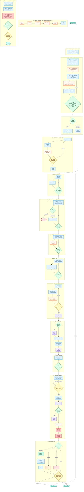

# Job Application Engine
**Version 2.2.0 — Generic Universal Edition**

**Author: _Ahmed AW (Ben Zayed) | Product Leader & Builder_**

An end-to-end AI-powered job application system for Claude, Claude CoWork, and Manus.
Supports two **session entry** modes: Mode A discovers matching roles across 10 platforms;
Mode B takes a CV and job URL directly and applies without discovery. **v2.1.x** adds two **execution** modes on CoWork — `agent_supported` (default) and optional `cowork_autonomous` with mandatory re-anchor to phase governance — see [docs/EXECUTION_MODES.md](docs/EXECUTION_MODES.md). Runs an 8-phase
workflow (with sub-phases 2A, 3B and 3C) and a native automation layer executing **18** declared actions (A01–A18) on the user's
behalf under a three-tier consent system. **v2.2.0** builds the CV itself and tests the real file
in an ATS Gate before anything is uploaded. Job board and ATS platform MCPs are detected
automatically at session start — if none are connected, the skill searches online and
recommends available options.

> **No external agents or frameworks required.** All logic is embedded in the skill
> files. Drop the ZIP into any supported platform and run.

---

## What's New in 2.2.0

The engine now builds and tests the CV, not only the application around it. Design record:
[docs/CV_ATS_REQUIREMENTS_SPEC_v0.11.0.md](docs/CV_ATS_REQUIREMENTS_SPEC_v0.11.0.md).

| Area | New in 2.2.0 |
|---|---|
| Setup | Intake questionnaire v4 — 5 paths from first job to executive; English and Arabic, other languages auto-translated; asks only what's missing, at most 10 questions per message |
| Phase 2 | **Step 2A** job analysis: numbered requirements, locked keyword list, one shared list with the fit check; gap log |
| Phase 3B | **CV Build**: write from the matching base CV, critique against one rubric, style pass that never changes locked keywords |
| Phase 3C | **ATS Gate** on the real file: export DOCX/PDF (A17), layout lint, 2-reader read test, visual review as ATS and recruiter, must-have coverage ≥ 90%, repeat cap, evidence trace, knockout alignment, freeze with fingerprint (`scripts/ats_gate.py`) |
| Scoring | 5 mandatory 5/5 gates (M1–M5) plus a visible grade with reasons for every other phase; a grade of 3 or lower stops you |
| Phase 6 | One combined verdict for CV and application; only the tested CV file is ever uploaded |
| Phase 7 | Application log, 7/14/21-day follow-up window, interview prep when an interview is booked |
| Countries | 6 country profiles (US, UK, Germany, Netherlands, UAE/GCC, Saudi Arabia) + General International |
| Fallbacks (A18) | When a tool or page fails, the engine moves down a ladder — connector → native tool → browser use → computer use → vision → ask you — instead of stopping. The same abilities audit CV pages, filled forms and portal previews. Never lowers a consent tier |
| Safety hooks | Optional, Claude Code only: block uploading a CV that didn't pass the ATS Gate; cancel a PASS after any edit (`hooks/`) |
| Capability wording | The engine only promises what this session can do: no browser or app brand names, never "on your computer" unless the Capability Map shows that tool active; "I can fill the form if you approve each step" only with browser control, otherwise "I'll give you answers to paste" |
| Testing | `scripts/selftest.py` (90 checks) and `evals/` (6 test cases, fixtures, grader, stored test replies). Release bar 100%. Final run: 40/40 checks vs 24/40 for v2.1.1 |

Everything from 2.1.1 still works: phase numbers, gate format, consent tiers, A01–A16,
execution modes, all 12 invariants (7 more added, 19 in total). Full mapping: spec Part 7.9.

---

## Quick Start

1. [Download `JAE-v2.2.0-Generic-Universal-2026-10-05.zip` from the v2.2.0 release Assets](https://github.com/ahmedbenaw/job-application-engine/releases/tag/v2.2.0)
2. Install the skill: 
- **Claude.ai / Claude CoWork** — **Customize → Skills → Create Skill → Upload ZIP**. 
- **Manus** — **Skills → + Add → Upload** or **Import from GitHub** (see [Platform Setup](#platform-setup)).
3. Choose your entry mode:

**Mode A — Discover roles matching your profile:**
> *"Find me Senior Product Manager roles in Berlin with relocation support"*
> The skill searches 10 platforms, ranks results, and guides the full workflow.

**Mode B — Apply to a specific role you already have:**
> Upload your CV (PDF or DOCX) + paste the job URL in the same message.
> The skill skips discovery entirely and runs the full application workflow
> for that specific role — from company intelligence through CV build, ATS Gate
> and submission.

**No CV and no job link yet?** Say *"help me apply"* — the skill runs setup, then
Mode A. Pasting a job link at any point switches to Mode B.

---

## What This Skill Does

The engine runs an 8-phase workflow (with sub-phases 2A, 3B and 3C) governed by scoring
gates. **Five mandatory gates** (M1–M5) each need a score of 5 out of 5 before advancing;
a score below 5 triggers a revision loop. Every other phase shows a **visible grade**
with its reasons the moment it finishes; a grade of 3 or lower turns it into a blocking
gate. Scores never authorise actions — approval phrases do.

**Execution modes (CoWork only; v2.1.x):** Default **`agent_supported`**. Optional **`cowork_autonomous`** uses larger host execution chunks with **`APPROVE COCHUNK`** (Tier 2), then **A15** re-anchor and **A16** drift check — phases and consent tiers are never bypassed. Details: [docs/EXECUTION_MODES.md](docs/EXECUTION_MODES.md).

**A0 — Capability Detection:** probes all tools and MCP connections at session start,
including a dedicated scan of 10 job board and ATS platform MCPs (LinkedIn, Indeed,
Greenhouse, Lever, Workday, Ashby, Wellfound, SmartRecruiters, Breezy HR, Recruitee).
If none are connected, it searches online and presents recommended MCPs. **v2.2.0:** also
checks CV export, text readers and browser / computer use / vision for the ATS Gate. The
first message combines a 3–5 line Capability Map summary, the details extracted from
your files, and the first batch of questions; replying counts as "Begin".

**Session Entry Gate:** detects the session mode automatically from uploaded files,
URLs, and message content. Routes to Mode A or Mode B without the user needing to
specify. Presents both options explicitly if the mode is ambiguous.

**Mode A — Job Discovery:** user wants to find matching roles. Proceeds to Phase 0.

**Mode B — Direct Application:** user has a specific role. Upload a CV and paste a
job URL — Phase 0 is skipped entirely, and the skill runs Phases 1–7 for that role.

**Phase 0 — Job Discovery (Mode A only):** searches 10 platforms in two passes,
uses active job board MCPs for authenticated access where available, filters excluded
geographies, ranks results by relocation support and level match, flags the top 5.

**Phase 1 — Company Intelligence:** runs four parallel operations — job posting fetch,
application form fetch with platform-aware strategy, hiring manager identification,
and company and product research — producing a Company Intelligence Brief.

**Phase 2 — Fit Analysis (with Step 2A):** Step 2A turns the job ad into numbered
requirements and a locked, weighted keyword list. The fit check maps evidence to the
same list (adversarial two-column gap mapping) and starts the gap log. Returns one of
three verdicts: Clean Fit, Honest Stretch, or Mismatch. A Mismatch verdict halts the
workflow — no application materials are produced. Gate **M2**.

**Phase 3 — Clarifying Intake (before any writing):** confirms all remaining facts in a
single block — portfolio URL, salary, availability, relocation, knockout criteria,
country profile, custom form questions, product trial observation, and language level
where required. Pre-filled from the profile. Gate **M3**.

**Phase 3B — CV Build:** writes the CV for this job from the matching base CV and the
evidence record, critiques it against one rubric, and runs a style pass that never
changes locked keywords. Nothing is invented: a keyword without proof goes to the gap
log. Gate **M4**.

**Phase 3C — ATS Gate:** exports the real DOCX and PDF (A17), then tests the files the
way an ATS and a recruiter see them — layout lint, 2-reader read test, visual review,
keyword coverage (must-haves ≥ 90%), evidence trace, knockout alignment, hygiene, and
country profile. On PASS the files are fingerprinted; any later edit cancels the PASS.

**Phase 4 — Application Package:** produces all deliverables — standard form fields,
experience summary, five-paragraph cover letter following both canonical templates,
and copy-paste answers to every custom question. The summary and gap lines come from the
gated CV and the gap log. Routes through Phase 5 before presenting.

**Phase 5 — Writing Quality Pass:** 25-pattern audit across 5 families removes
AI-generated patterns. Two internal passes run; only the final version is presented.
Locked keywords are protected. Gate **M5** covers Phases 4–5.

**Phase 6 — Combined Final Verdict:** the eight governance checks (completeness, claim
traceability, salary format, gap acknowledgment, token resolution, word count, URL
validity, salary field type) plus **Check 9 — ATS Gate PASS**, public-profile
consistency, and a decision for every gap-log entry. Only the fingerprinted file from
the latest PASS may be uploaded.

**Phase 7 — Post-Submission Loop:** three branches — submitted (anchors next
discovery), withdrawn (logs reason, refines next pass), rejected (identifies gap,
recalibrates search). v2.2.0 adds the application log (outcome against the CV
fingerprint and gate results), a 7/14/21-day follow-up window, and interview prep
when an interview is booked.

**Automation Layer (v2.2.0):** 18 declared automations (A01–A18) execute on the
user's behalf under a three-tier consent system. A14–A16 orchestrate CoWork autonomous chunks and governance re-anchor only when applicable. **A17** exports the CV file for the ATS Gate. **A18** is the fallback ladder: when a tool or page fails, the engine moves to browser use, computer use or vision instead of stopping, and uses the same abilities to audit files and forms. Scoring gates evaluate quality.
Approval gates authorise real-world actions. These are entirely separate systems.

---

## Workflow Diagram


```mermaid
flowchart TB

  %% ── SESSION START ─────────────────────────────────────
  START([" 🟢 Session Start "]):::entry

  %% ── EXECUTION MODE (before A0; CoWork can opt in to cowork_autonomous) ──
  subgraph EM["  Execution mode · before A0"]
    direction TB
    EM_SET["Set execution mode\ndefault agent_supported\nCoWork: opt-in autonomous"]:::step
  end
  START --> EM_SET

  %% ── A0 — CAPABILITY DETECTION (order matches SKILL.md A0) ──
  subgraph CAP["  A0 · Capability Detection"]
    direction TB
    A0_PT["STEP 1 · Probe core tools\n+ Job Board MCPs (1B)\n+ CV export, text readers,\nbrowser / computer use / vision"]:::step
    A0_REC["STEP 1C · MCP discovery\n(if all JB/ATS MCPs inactive)"]:::autonode
    A0_CM["STEP 2 · Build Capability Map\n3–5 line summary"]:::step
    A0_2A["STEP 2A · Mandatory artifact\nfallback if files/shell inactive"]:::autonode
    A0_BD["STEP 3 · Browser path note\nBrowserBase / Playwright / manual"]:::step
    A0_OK{STEP 4 · One first message ·\nsummary + extracted details\n+ first questions · reply = Begin}:::gate
    A0_PT --> A0_REC --> A0_CM --> A0_2A --> A0_BD --> A0_OK
    A0_OK -- No / revise --> A0_CM
  end
  EM_SET --> A0_PT

  %% ── SESSION ENTRY GATE ────────────────────────────────
  subgraph SEG["  Session Entry Gate"]
    direction LR
    SEG_D{Mode\nDetected?}:::gate
    SEG_A["Mode A\nJob Discovery\n(also: no CV + no link)"]:::step
    SEG_B["Mode B\nDirect Apply"]:::step
    SEG_D -- "Mode A" --> SEG_A
    SEG_D -- "Mode B\nCV + Job URL" --> SEG_B
  end
  A0_OK -- Yes --> SEG_D

  %% ── PHASE 0 — JOB DISCOVERY (Mode A only) ────────────
  subgraph PH0["  P0 · Job Discovery  ·  Mode A only"]
    direction LR
    P0_PS["Platform Search\n& Filter"]:::step
    P0_JB["Job Board\nFetch"]:::step
    P0_MCP["Job Board MCP\nif active"]:::autonode
    P0_G{Top 5 scored ·\ngrade shown}:::grade
    P0_FJ["Full JD\nFetch"]:::step
    P0_PS --> P0_JB --> P0_MCP --> P0_G
    P0_G -- "≤ 3 · fix" --> P0_PS
    P0_G -- "> 3" --> P0_FJ
  end
  SEG_A --> PH0

  %% ── PHASE 1 — COMPANY INTELLIGENCE ──────────────────
  subgraph PH1["  P1 · Company Intelligence"]
    direction LR
    P1_PR["Parallel\nResearch"]:::step
    P1_FF["Form Fetch\n& Parse"]:::step
    P1_G{M1 · Company\nScore 5?}:::gate
    P1_PR --> P1_FF --> P1_G
    P1_G -- No --> P1_PR
  end
  P0_FJ --> PH1
  SEG_B --> PH1

  %% ── PHASE 2 — FIT ANALYSIS (with Step 2A) ────────────
  subgraph PH2["  P2 · Fit Analysis  ·  with Step 2A"]
    direction LR
    P2_JA["2A · Job analysis\nnumbered requirements\n+ locked keyword list"]:::step
    P2_FV{Fit\nVerdict?}:::gate
    P2_MH(["🚫 Mismatch\nHalt"]):::halt
    P2_EM["Evidence mapping\n+ gap log"]:::step
    P2_FS{M2 · Fit\nScore 5?}:::gate
    P2_JA --> P2_FV
    P2_FV -- Mismatch --> P2_MH
    P2_FV -- "Clean Fit or\nHonest Stretch" --> P2_EM --> P2_FS
    P2_FS -- No --> P2_JA
  end
  P1_G -- Yes --> PH2

  %% ── PHASE 3 — CLARIFYING INTAKE (before any writing) ─
  subgraph PH3["  P3 · Clarifying Intake  ·  before any writing"]
    direction LR
    P3_CG["Confirm facts · knockout\ncriteria · country profile"]:::step
    P3_EH["Email Hiring\nManager"]:::autonode
    P3_G{M3 · Facts\nScore 5?}:::gate
    P3_CG --> P3_EH --> P3_G
    P3_G -- No --> P3_CG
  end
  P2_FS -- Yes --> PH3

  %% ── PHASE 3B — CV BUILD ─────────────────────────────
  subgraph PH3B["  P3B · CV Build"]
    direction LR
    P3B_W["Write CV from\nbase CV + evidence"]:::step
    P3B_C["Critique +\nstyle pass\n(locked keywords kept)"]:::step
    P3B_G{M4 · CV text\nScore 5?}:::gate
    P3B_W --> P3B_C --> P3B_G
    P3B_G -- No --> P3B_W
  end
  P3_G -- Yes --> PH3B

  %% ── PHASE 3C — ATS GATE ─────────────────────────────
  subgraph PH3C["  P3C · ATS Gate"]
    direction LR
    P3C_X["A17 · Export\nDOCX + PDF"]:::step
    P3C_T["Counted checks\nscripts/ats_gate.py"]:::step
    P3C_V["Visual review\nas ATS + recruiter"]:::autonode
    P3C_G{Gate verdict ·\ngrade shown}:::grade
    P3C_F["Freeze PASS ·\nfingerprint files"]:::storage
    P3C_X --> P3C_T --> P3C_V --> P3C_G
    P3C_G -- "FAIL · retry" --> P3C_X
    P3C_G -- PASS --> P3C_F
  end
  P3B_G -- Yes --> PH3C

  %% ── PHASE 4 — APPLICATION PACKAGE ───────────────────
  subgraph PH4["  P4 · Application Package"]
    direction LR
    P4_SQ{Save to\nCloud?}:::gate
    P4_CS["Cloud\nSave"]:::storage
    P4_PM["Prepare Application\nMaterials"]:::step
    P4_CL["Create Cover\nLetter"]:::step
    P4_LD["Local\nDownload"]:::storage
    P4_SQ -- Yes --> P4_CS --> P4_PM
    P4_SQ -- No --> P4_PM
    P4_PM --> P4_CL --> P4_LD
  end
  P3C_F --> PH4

  %% ── PHASE 5 — WRITING QUALITY PASS ──────────────────
  subgraph PH5["  P5 · Writing Quality Pass"]
    direction LR
    P5_PA["Pattern Removal\n& Audit"]:::step
    P5_G{M5 · Package\nScore 5?}:::gate
    P5_PA --> P5_G
    P5_G -- No --> P5_PA
  end
  P4_LD --> PH5

  %% ── PHASE 6 — COMBINED FINAL VERDICT ─────────────────
  subgraph PH6["  P6 · Combined Final Verdict"]
    direction LR
    P6_SQ["8 checks + Check 9\nATS Gate PASS"]:::step
    P6_G{Combined verdict ·\ngrade shown}:::grade
    P6_FP["Create Full\nPackage Doc"]:::step
    P6_LD["Local\nDownload 2"]:::storage
    P6_SC{Save to\nCloud 2?}:::gate
    P6_CS2["Cloud\nSave 2"]:::storage
    P6_VU["Verify upload ·\ntested file only"]:::autonode
    P6_BF["Browser\nForm Fill"]:::danger
    P6_AS["Application\nSubmit"]:::danger
    P6_SQ --> P6_G
    P6_G -- "FAIL · back to P4 or P3B" --> P6_SQ
    P6_G -- PASS --> P6_FP --> P6_LD --> P6_SC
    P6_SC -- Yes --> P6_CS2 --> P6_VU
    P6_SC -- No --> P6_VU
    P6_VU --> P6_BF --> P6_AS
  end
  P5_G -- Yes --> PH6

  %% ── PHASE 7 — POST SUBMISSION LOOP ──────────────────
  subgraph PH7["  P7 · Post Submission Loop"]
    direction LR
    P7_OB{Outcome\nBranching}:::gate
    P7_A["Branch A\nSubmitted"]:::branchA
    P7_B["Branch B\nWithdrawn"]:::branchB
    P7_C["Branch C\nRejected"]:::branchC
    P7_CR["Calendar\nReminder\n7 / 14 / 21 days"]:::step
    P7_ES["Email\nto Self"]:::step
    P7_G{Application log ·\ngrade shown}:::grade
    P7_OB -- Submitted --> P7_A
    P7_OB -- Withdrawn --> P7_B
    P7_OB -- Rejected --> P7_C
    P7_A --> P7_CR --> P7_ES --> P7_G
    P7_B --> P7_G
    P7_C --> P7_G
    P7_G -- "≤ 3 · fix" --> P7_OB
  end
  P6_AS --> PH7

  %% ── SESSION END ──────────────────────────────────────
  NEXT([" 🔄 Next Discovery "]):::entry
  DONE([" ⏹ Session Close "]):::entry
  P7_G -- "Branch A" --> NEXT
  NEXT -. "back to P0" .-> PH0
  P7_G -- "B or C" --> DONE

  %% ── A18 — FALLBACK LADDER (any phase) ────────────────
  subgraph FB["  A18 · Fallback ladder · any phase · never lowers a consent tier"]
    direction LR
    FB1["MCP"]:::autonode --> FB2["Native\ntool"]:::autonode --> FB3["Browser\nuse"]:::autonode --> FB4["Computer\nuse"]:::autonode --> FB5["Vision"]:::autonode --> FB6["Ask the\nperson"]:::step
  end

  %% ── LEGEND ───────────────────────────────────────────
  subgraph LEGEND["  Legend — Consent Tiers · separate from scoring"]
    direction LR
    LL1["⚡ Tier 1 — Auto\nRead-only · no gate"]:::step
    LL2["📄 Tier 2 — APPROVE\nReversible write"]:::step
    LL3["🚀 Tier 3 — APPROVE PHRASE\nIrreversible · full preview\nScore ≠ Approval"]:::danger
    LLG{Mandatory gate\nM1–M5 · need 5}:::gate
    LLC{Visible grade\nblocks at ≤ 3}:::grade
    LLS([Session\nStart/End]):::entry
  end

  %% ── STYLES — light mode ──────────────────────────────
  classDef entry    fill:#ccfbf1,stroke:#0d9488,stroke-width:2px,color:#134e4a,font-weight:bold
  classDef step     fill:#e0f2fe,stroke:#0284c7,stroke-width:1.5px,color:#0c4a6e
  classDef autonode fill:#fff7ed,stroke:#ea580c,stroke-width:1.5px,color:#7c2d12
  classDef gate     fill:#dcfce7,stroke:#16a34a,stroke-width:2px,color:#14532d,font-weight:bold
  classDef grade    fill:#fef9c3,stroke:#ca8a04,stroke-width:2px,color:#713f12,font-weight:bold
  classDef halt     fill:#fee2e2,stroke:#dc2626,stroke-width:2.5px,color:#7f1d1d,font-weight:bold
  classDef danger   fill:#fecaca,stroke:#ef4444,stroke-width:2px,color:#7f1d1d
  classDef storage  fill:#ede9fe,stroke:#7c3aed,stroke-width:1.5px,color:#4c1d95
  classDef branchA  fill:#d1fae5,stroke:#059669,stroke-width:1.5px,color:#064e3b
  classDef branchB  fill:#ffedd5,stroke:#f97316,stroke-width:1.5px,color:#7c2d12
  classDef branchC  fill:#fee2e2,stroke:#ef4444,stroke-width:1.5px,color:#7f1d1d
```

| Symbol | Meaning |
|--------|---------|
| 🟢 Teal pill | Session start **and** end — both `Session Start` and `Session Close` |
| 🟩 Green diamond | Mandatory gate (M1–M5, setup sign-off, A0 start) or user decision — 5/5 required · loops back on fail |
| 🟨 Yellow diamond | Visible grade (v2.2.0) — shown with its reason; doesn't stop you unless it is 3 or lower, or you score it below 5 |
| 🟦 Blue rectangle | Process step — auto-executes · also Tier 2 reversible actions |
| 🟧 Orange rectangle | Automation/special runtime node (e.g. MCP discovery, artifact fallback, A18 fallback rungs, visual review, upload verification) |
| 🟥 Red rounded pill | **Mismatch halt** — workflow stops entirely |
| 🟣 Purple rectangle | File storage or frozen state — local download always before cloud save; ATS Gate PASS fingerprints |
| 🔴 Light-red rectangle | Irreversible action — `APPROVE SUBMIT` and `APPROVE FILL` |
| `- -` Dashed arrow | Loop back to Phase 0 after successful submission |

---

## Who It Is For

This generic edition works for any job seeker running a structured, disciplined
application process. It is particularly suited to candidates applying across multiple
markets, targeting different seniority levels simultaneously, or managing several
active applications in parallel. The Applicant Profile template holds multiple versions
of key fields — positioning headlines, professional summaries, evidence selection —
so the system adapts to each role without starting from scratch.

---

## Repository Structure

```
job-application-engine/
├── README.md                                ← This file + workflow diagram
├── LICENSE                                  ← MIT licence
├── CHANGELOG.md                             ← Version history (v1.0 · v2.x)
├── .gitignore
├── SKILL.md                                 ← Main skill file
│                                               8-phase engine (+ 2A, 3B, 3C) + automation layer
├── rules.json                               ← Machine-readable workflow rules
│                                               + automation layer bindings
├── automation-registry.json                 ← All 18 declared automations
│                                               (A01–A18) · scope-locked
├── docs/                                    ← Canonical platform + scope + execution modes
│                                               + CV & ATS spec (design record) + release notes
├── scripts/
│   ├── ats_gate.py                          ← Phase 3C counted checks · PASS freeze · upload verify
│   └── selftest.py                          ← Release harness (run before every release)
├── evals/                                   ← 6 test cases · fixtures · grade.py · stored replies (maintainers)
├── hooks/                                   ← Optional Claude Code hooks + settings snippet
└── references/
    ├── applicant-profile-template.md        ← Central source of truth · fill first
    ├── intake-questionnaire.md              ← Intake v4 · 5 paths · privacy classes (v2.2.0)
    ├── first-use-protocol.md                ← First-Use Steps 0–5 (moved from SKILL.md)
    ├── cv-build.md                          ← Phase 3B CV Build (v2.2.0)
    ├── ats-gate.md                          ← Phase 3C ATS Gate, GATE-00–18 (v2.2.0)
    ├── country-profiles.md                  ← 6 countries + General International (v2.2.0)
    ├── workflow-integration.md              ← Gates, grades, handoffs (v2.2.0)
    ├── application-log-template.md          ← Handoff record · gap log · application log
    ├── automation-layer.md                  ← A0 + automation layer (moved from SKILL.md)
    ├── platform-execution-notes.md          ← Per-platform behaviour (moved from SKILL.md)
    ├── cover-letter-templates.md            ← Both canonical templates
    ├── salary-anchors-template.md           ← Market salary data
    ├── job-level-framework.md               ← 7-level classification framework
    ├── excluded-companies-log.md            ← Discovery filter + outcomes log
    ├── automation-playbooks/                ← Automation execution specs
    │   ├── job-board-access.md             ← A01, A02 — search & fetch
    │   ├── application-filling.md          ← A03, A04, A05 — form fill & submit
    │   ├── email-actions.md                ← A08, A11 — email draft & send
    │   ├── document-creation.md            ← A06, A07, A09, A17 — docs, CV export & cloud save
    │   └── vision-browser-computer-fallback.md ← A18 — fallback ladder & visual audits
    └── skill-instructions/                  ← Inline module documentation
        ├── fit-analysis.md                  ← Phase 2 module
        ├── writing-quality.md               ← Phase 5 module (25 patterns)
        ├── governance-gate.md               ← Phase 6 module (8 checks + Check 9)
        └── checklist-templates.md           ← Dynamic status board system
```

---

## Platform Setup

**Canonical docs (read these — normative for the skill):**

- [docs/platform-capabilities.md](docs/platform-capabilities.md) — Claude.ai, CoWork, Manus, hybrid patterns, execution modes  
- [docs/EXECUTION_MODES.md](docs/EXECUTION_MODES.md) — `agent_supported` vs `cowork_autonomous`, re-anchor, opt-in phrases  
- [docs/MANDATORY_EXCLUSIONS.md](docs/MANDATORY_EXCLUSIONS.md) — scope law (hard prohibited · host-gated · registry-native)  
- [docs/REMEDIATION_INVENTORY.md](docs/REMEDIATION_INVENTORY.md) — traceability of documentation passes  
- [docs/CV_ATS_REQUIREMENTS_SPEC_v0.11.0.md](docs/CV_ATS_REQUIREMENTS_SPEC_v0.11.0.md) — design record for v2.2.0 (CV build, ATS Gate, intake, scoring)  

> **Agent Skills (where the product offers them):** On **Claude.ai** and **Claude CoWork**, uploading this skill via the product’s **Skills** UI is the primary install path (exact menu labels depend on Anthropic’s current UI — see their documentation for your plan). Skills give **in-session** tool and MCP use within that product’s limits — not the same as every CoWork-class workspace feature. **Manus** supports **Skills** too: **Skills → + Add → Upload a skill** (`.zip` / `.skill`) or **Import from GitHub** using this repo’s public URL. Fallbacks below apply when Skills are unavailable or you prefer file-based loading.

---

### Claude.ai — Web (Skills UI); mobile varies by app version

**Primary — Agent Skills install** *(requires a Claude plan that includes Skills — see Anthropic’s current documentation)*

This method makes the skill available across conversations that support Skills.

1. [Download the ZIP from Releases](https://github.com/ahmedbenaw/job-application-engine/releases/tag/v2.2.0)
2. In Claude (web): profile → **Customize** → **Skills** → **Create Skill** → upload the ZIP  
   On **mobile**, use the path your Claude app exposes for **Skills**; if Skills are not exposed, use **Project Knowledge** fallback below.
3. The skill is active where Skills apply — no separate project is required for that mode.
4. Begin with a trigger such as: *"Find me jobs similar to [ROLE] in [CITY]"*

**Alternative — Project Knowledge upload** *(accounts without Skills or mobile without Skills UI)*

1. Go to [claude.ai](https://claude.ai) → **Projects** → **New Project**
2. **Project Settings** → **Project Knowledge**
3. Upload **every** skill file: `SKILL.md`, `rules.json`, `automation-registry.json`, **all** files under `references/` (both subfolders), and `scripts/ats_gate.py`, preserving paths where the UI allows. (`evals/` and `hooks/` are for maintainers and not needed.)
4. Use the skill only inside that project.

**Alternative — Git clone then upload to Project Knowledge**

```bash
git clone https://github.com/ahmedbenaw/job-application-engine.git
```

Upload the same file set from the clone into Project Knowledge as above.

**How it runs on Claude.ai:** All phases run **sequentially** in one conversation. Mandatory gates M1–M5 need 5/5; every other phase shows its grade. No CV or application text is written before the Phase 3 facts are confirmed. Phase 3C needs file creation and code execution; without them the gate can't PASS and nothing is uploaded — run Phases 3B–3C in CoWork instead.

**Best for:** Single-thread review and scoring gates in chat.

**Limitation:** No parallel phase fan-out like CoWork Tier-1. For **many** platform searches at once, **CoWork** (or splitting work manually) is faster. For **LinkedIn / Indeed** and other bot-heavy targets, prefer environments with reliable **browser MCP** when chat-only fetch is weak — see `SKILL.md` A0 and job-board strategy.

---

### Claude CoWork

**Primary — Agent Skills install**

1. [Download the ZIP from Releases](https://github.com/ahmedbenaw/job-application-engine/releases/tag/v2.2.0)
2. **Customize → Skills → Create Skill** → upload the ZIP (labels per current CoWork UI).
3. The skill is available to CoWork agents that load Skills.
4. Open a **New Project** and run the workflow. **Parallelism** for Phases 0, 1, and Phase 3 salary research is **defined in this skill** (`SKILL.md`, `rules.json`); CoWork **allows** parallel Tier-1 work — the product does not auto-route phases without those rules.

**Alternative — Workspace file upload** *(if Skills are unavailable on your tier)*

1. [Download the ZIP from Releases](https://github.com/ahmedbenaw/job-application-engine/releases/tag/v2.2.0)
2. CoWork → **New Project** → **Upload**
3. Upload **all** files from the extracted ZIP (root files plus the entire `references/` and `scripts/` trees — same set `git ls-files` would list from this repo). Preserve folder hierarchy.
4. CoWork reads `rules.json` as the workflow instruction source.

**Alternative — Git clone**

```bash
git clone https://github.com/ahmedbenaw/job-application-engine.git
```

Upload the clone into the workspace as above.

**How it runs on CoWork:** Phases 0, 1, and salary research in Phase 3 may run as **parallel Tier-1 subagents**. Phase 2 returns a verdict before Phase 3B and Phase 4. Phases 2A, 3B, 3C, 5 and 6 run **sequentially**. Tier 2 and Tier 3 automations run only on the **main coordination thread** (never on subagents). Optional **Mode 2** (`cowork_autonomous`) uses A14–A16 with re-anchor — see [docs/EXECUTION_MODES.md](docs/EXECUTION_MODES.md). Checklist format: static file artifact per [references/skill-instructions/checklist-templates.md](references/skill-instructions/checklist-templates.md).

**Best for:** Parallel discovery, workspace artifacts, downloadable packages when the host supports file presentation.

**Limitation:** Handoff between subagents and the main thread may need your confirmation. For a single linear chat thread, use Claude.ai.

---

### Claude.ai + CoWork Combined

Install via **Skills** on both hosts when available. Two patterns — see [docs/platform-capabilities.md](docs/platform-capabilities.md):

**`hybrid_chat_review` (DEFAULT)** — CoWork speed for research, Claude.ai for dense review:

- **Phases 0 and 1** → CoWork (parallel Tier-1 where applicable)
- Copy the **Company Intelligence Brief** into Claude.ai
- **Phases 2–7** → Claude.ai (sequential scoring gates and drafting review in one thread)
- **v2.2.0:** if that Claude.ai session can't create files or run code, run **Phases 3B–3C** (CV export and ATS Gate) in CoWork, then continue in Claude.ai

**`cowork_end_to_end` (SECONDARY)** — all **Phases 0–7** in CoWork when workspace files, downloads, or browser-heavy steps should stay in one place.

**Best for:** `hybrid_chat_review` when you want parallel discovery plus chat-centric writing review; `cowork_end_to_end` when file/workspace delivery dominates.

---

### Manus

**Primary — Agent Skills (current product)**

1. [Download the ZIP from Releases](https://github.com/ahmedbenaw/job-application-engine/releases/tag/v2.2.0) *or* use **Import from GitHub** with  
   `https://github.com/ahmedbenaw/job-application-engine`
2. In Manus: **Skills** tab → **+ Add** → **Upload a skill** (`.zip` / `.skill`) **or** **Import from GitHub** (public repo URL above).

**Fallback — Workspace upload + `rules.json`**

1. Download and extract the release ZIP (or clone the repo).
2. Upload all skill files into the Manus project workspace (same full `references/` and `scripts/` trees as source).
3. Ensure `rules.json` is loaded as the session instruction source if your workflow requires it.

**Fallback — Paste `rules.json`**

Paste the full contents of `rules.json` into the project as `.json` or `.md` at session start when file upload is impractical.

**How it runs on Manus:** Same eight phases, sub-phases and gates; Phase 3C needs code execution for `scripts/ats_gate.py`; Tier 1 inline; Tier 2/3 as text prompts. Status board = **text block** in session (see checklist-templates **Platform Notes**). Browser: Manus native browser when BrowserBase/Playwright MCPs are unavailable. **`present_files`:** may be unavailable — the skill uses **inline artifact fallback** (`SKILL.md` A0 STEP 2A); users may need to copy/save outputs manually.

**Best for:** Longer agent sessions and multi-step application tracking in Manus.

---

### Claude Code (optional — enforcement hooks and maintainers)

Not a primary end-user platform. Use it when you want the two submission rules enforced by code:

1. [Download `job-application-engine-plugin.zip` from Releases](https://github.com/ahmedbenaw/job-application-engine/releases/tag/v2.2.0) and install it as a Claude Code plugin, **or** copy `hooks/settings-snippet.json` into `.claude/settings.json` (replace `/ABSOLUTE/PATH/TO/`).
2. Restart Claude Code. The hooks then block uploading a CV that is not the file from the latest ATS Gate PASS, and cancel a PASS after any edit. Details: [hooks/README.md](hooks/README.md).

Maintainers run `python3 scripts/selftest.py` and the evals in `evals/` before every release (bar: 100%). Use the plugin **or** a Skills upload in one account, not both.

---

## First-Use Setup Protocol

The skill builds your Applicant Profile automatically — it extracts data from
any documents or links you provide before asking a single question manually.

**What to provide (any combination works):**

| Source | What gets extracted |
|---|---|
| CV / Resume (PDF or DOCX) | Name, contact, education, work history, tools, skills, certifications |
| LinkedIn profile URL | Headline, experience, education, skills, certifications, contact |
| GitHub profile URL | Repos, languages, tools, project descriptions |
| Personal website / portfolio URL | Bio, projects, contact information |
| Behance / Dribbble URL | Project names, descriptions, tools used |
| Text description in chat | Any background you describe in your opening message |

**How it works:**

1. At session start, the skill runs **Step 0 — Document Detection** first.
   It reads every uploaded file and fetches every URL you provided.
2. It extracts every recognisable profile field from those sources and
   presents a confirmation summary showing what was found.
3. You confirm, correct, or add to the extracted values.
4. Only for fields that could not be extracted does it ask follow-up questions.
5. The complete profile is presented for final review and a scoring gate
   (score of 5 required before the workflow begins).

**If you provide a CV and a LinkedIn URL, most fields populate with zero
manual typing.** If you provide nothing, the skill uses the **intake questionnaire v4**
(`references/intake-questionnaire.md`): it picks your path (first job to executive),
asks only what's missing, **at most 10 questions per message** under "Questions for
you (N)", and asks the rest where they are used. Private answers (salary, permit status,
sponsorship need) are never printed on a CV, and government ID numbers are never collected.

**Profile updates during and after applications:**

The profile is not a one-time setup. The skill updates it at two points
during every application cycle:

After **Phase 3 (Clarifying Intake):** if new information collected during
the intake differs from the profile (new salary confirmation, updated
availability, new tool added to your stack, language level change), the
skill flags the difference and asks for approval to update the profile field.

After **Phase 7 (Post-Submission Loop):** every application outcome —
submitted, withdrawn, or rejected — is logged and checked for profile
implications. An offer received updates salary anchors. A recurring rejection
pattern triggers a seniority or sector targeting review. All updates require
explicit `APPROVE UPDATE` before being written.

**Staleness checks at every session start:**

Time-sensitive fields (availability, active notice period, salary anchors)
are checked at the start of every session. Fields that are stale beyond their
review cycle are flagged and re-confirmed before Phase 0 begins.

---

## Automation Layer (v2.2.0)

Version 2.x adds a native execution layer beneath the 8-phase workflow. **v2.1.x** adds A14–A16 for CoWork execution-mode orchestration. **v2.2.0** adds A17 (CV file export) and A18 (fallback ladder and visual audits), and A04 now uploads only the tested CV file. All phase numbers, the gate format, consent tiers and the original invariants are unchanged. The automation layer is purely additive.

### 18 Registered Automations

| ID | Automation | Phase | Tier | Approval Phrase |
|---|---|---|---|---|
| A01 | Job board search and fetch | 0 | 1 — auto | — |
| A02 | Full JD fetch for top 5 | 0 post-table | 1 — auto | — |
| A03 | Application form fetch and parse | 1 | 1 — auto | — |
| A04 | Browser form field filling (uploads only the tested CV) | 6 | 3 | `APPROVE FILL` |
| A05 | Application submission | 6 post-fill | 3 | `APPROVE SUBMIT` |
| A06 | Cover letter DOCX creation | 4 | 2 | `APPROVE CREATE` |
| A07 | Full application package document | 6 | 2 | `APPROVE CREATE` |
| A08 | Email to hiring manager / recruiter | 3 or 7 | 3 | `APPROVE SEND` |
| A09 | Cloud document save | After A06 / A07 | 2 | `APPROVE SAVE` |
| A10 | Calendar follow-up reminder | 7 | 2 | `APPROVE CALENDAR` |
| A11 | Confirmation email to self | 7 | 2 | `APPROVE SEND` |
| A12 | Job board MCP authenticated search | 0 (when MCP active) | 1 — auto | — |
| A13 | Job board MCP discovery search | A0 Step 1C | 1 — auto | — |
| A14 | CoWork autonomous host chunk | All (Mode 2 only) | 2 | `APPROVE COCHUNK` |
| A15 | Governance re-anchor checkpoint | All (after A14) | 1 — auto | — |
| A16 | Drift / scope verification | All (after A15) | 1 — auto | — |
| A17 | CV file export for the ATS Gate (DOCX + PDF) | 3C | 2 | `APPROVE CREATE` (one per application by default) |
| A18 | Vision, browser and computer-use fallback and visual audit | All (when a tool fails; GATE-18; form and upload checks) | 1 — auto · actions keep their own tier | — |

### Consent Tiers

**Tier 1 — Read-only:** auto-executes as part of the phase. No separate gate.

**Tier 2 — Reversible write:** requires `APPROVE [ACTION_NAME]` typed explicitly.
A score of 5 or "yes" is not accepted.

**Tier 3 — Irreversible:** requires the full consent gate — complete preview of all
data being transmitted, destination, and timestamp — followed by exact typed phrase.
Cannot be triggered by a score, "yes", or any paraphrase.

> **Approval and scoring are entirely separate systems and must never be conflated.**

### Capability Map

At session start, before any phase begins, the skill probes the current environment
and presents a Capability Map with two sections: core tools and automations, and a
dedicated Job Board & ATS Platform MCPs section. Every automation shows as ACTIVE,
LIMITED, or INACTIVE with the connection required to enable each inactive one.

If all job board and ATS MCPs are inactive, the skill automatically runs A13 —
a web search that finds currently available job board MCPs on GitHub and npm —
and presents recommendations below the Capability Map. web_search and web_fetch
provide full discovery capability without MCPs; job board MCPs are an enhancement
that unlocks authenticated features (saved jobs, Easy Apply, application status tracking).

### Browser Automation

**BrowserBase MCP** is the primary path. **Playwright MCP** is the secondary path —
a plain-language disclosure of its behaviour and limitations is presented before use.
When neither is available, the skill generates pre-staged numbered answers for manual entry.
A host-reported browser tool is used only as shown in the Capability Map (A18), never as a
separate vendor path — see [docs/MANDATORY_EXCLUSIONS.md](docs/MANDATORY_EXCLUSIONS.md).
You always log in yourself; the skill never types passwords or one-time codes.

### Email and Cloud Storage

Email provider is always selected by the user per session — never assumed or hardcoded.
Documents are always presented for local download first; cloud save is offered separately
after, with provider selection and folder path confirmation before any upload.

---

## Customisation

**Add a geography exclusion:** append to `[HARD_EXCLUSION_GEOGRAPHIES]` in the
Applicant Profile and to `references/excluded-companies-log.md`.

**Add a salary market:** append to Confirmed Anchors in `references/salary-anchors-template.md`.

**Add a country profile:** copy the General International column in `references/country-profiles.md`, change only the fields that differ (with a source and date), and log it in the spec and `CHANGELOG.md`.

**Add an automation:** declare in `automation-registry.json` with ID, phase binding,
consent tier, approval phrase, tool/MCP requirement, and scope boundary.

**Adapt for a specific candidate:** populate the Applicant Profile with their data.
Dynamic fields, salary architecture, and evidence catalogue all support multiple
simultaneous variants activated by role context.

---

## Key Design Decisions

**Why two session entry modes?** Most documentation assumes the user starts with no
role in mind. In practice, the most common session start is a user arriving with a
CV already written and a specific job URL to apply to. Forcing them through a
10-platform discovery phase they do not need wastes time and creates friction at
exactly the wrong moment. Mode B exists to meet users where they actually are.

**Why extract profile data from documents instead of asking questions?** A candidate
who uploads a CV and LinkedIn URL should not be asked to re-type information that
already exists in structured form. Document extraction first, gap-fill questions
second, means most profiles populate with minimal manual input. Questions are a
fallback, not the default.

**Why detect job board MCPs automatically and search for more if none are found?**
Users do not know which MCPs exist or which would help them. Requiring them to
research and connect MCPs before the skill is useful creates unnecessary friction.
The skill surfaces what is available and what is possible — the user decides what
to connect.

**Why five mandatory gates plus visible grades, not a gate at every phase?** Gates give
the system a learning signal between phases, but eight to ten 5/5 stops per application
wore people out. v2.2.0 keeps five mandatory gates where your judgement matters (company,
fit, facts, CV text, package) and shows every other phase's grade with its reasons. A grade
of 3 or lower still stops you, so nothing weak slips through silently.

**Why test the real CV file, not just the text?** ATS systems read the file. Tables,
header text, text boxes, fonts and export quirks can break parsing even when the text is
perfect. The ATS Gate reads the exported file with two readers, looks at each page as an
image, and fingerprints the files that pass so only the tested file can be uploaded.

**Why a fallback ladder?** A blocked job page or a missing tool used to end a step. A18
tries the next option — browser, computer use, vision — and only then asks you to paste
something. Consent tiers never drop on the way down.

**Why does the engine never name a browser or say "on your computer"?** People
take a promise literally. If a session can't control a browser, saying "I'll open it
in your browser" sets up a step that will never happen. Wording follows the Capability
Map: what is active is offered; what isn't is replaced by what will actually happen
("I'll give you answers to paste").

**Why are the hooks optional?** Hooks run code on your machine and only exist in Claude
Code. They enforce two rules the skill already follows; everywhere else the same rules
hold as instructions.

**Why is Mismatch a hard halt?** Two or more mandatory gaps with no compensating
evidence means the application is not viable — producing materials anyway wastes the
candidate's time and reputation.

**Why is the product trial observation required?** A candidate who used the product
and noticed something actionable is categorically different from one who read the
website. This paragraph cannot be generated without the trial.

**Why 25 patterns across 5 families?** Statistical regularities in AI-generated
text are detectable. Removing patterns is necessary but not sufficient — the output
must also vary rhythm, add specificity, and match the candidate's seniority voice.

**Why is approval separate from scoring?** Scoring gates evaluate output quality.
Consent gates authorise irreversible real-world actions. Conflating them would allow
a phase score to accidentally trigger a form submission or email send.

---

## Licence

MIT. See `LICENSE` for full terms.

---

## Changelog

See `CHANGELOG.md` for the full version history. Current version: **2.2.0**.
